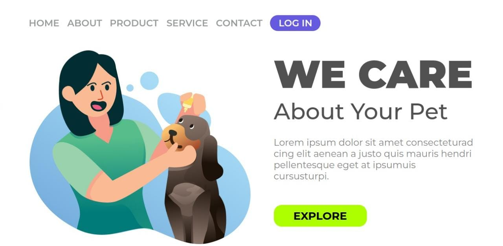
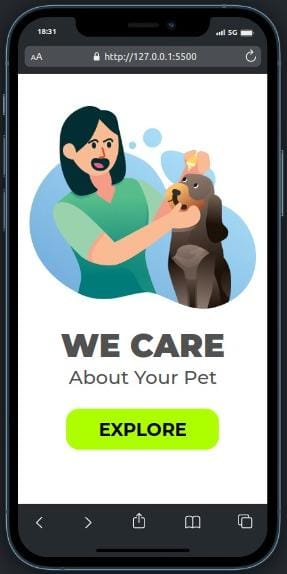

# Título do Projeto

Este projeto é uma landing page de uma empresa de Pet Shop, onde existe um menu para qualquer coisa que o cliente deseje. 

## Tecnologias Utilizadas

- HTML
- CSS

## Como Usar

1. Clone o repositório
2. Execute o projeto com a extensão do VsCode `go live`

## Layout e Design
`Deploy`: https://willianamorim.github.io/We-Care-Your-Pet/

## Como Contribuir

1. Clone o repositório
2. Faça as mudanças necessárias e crie um novo branch com o nome da sua funcionalidade
4. Envie um pull request

## Contato

Entre em contato comigo pelo `e-mail` willianamorim1@outlook.com.br ou pelo `LinkedIn` https://www.linkedin.com/in/willian-s-amorim/